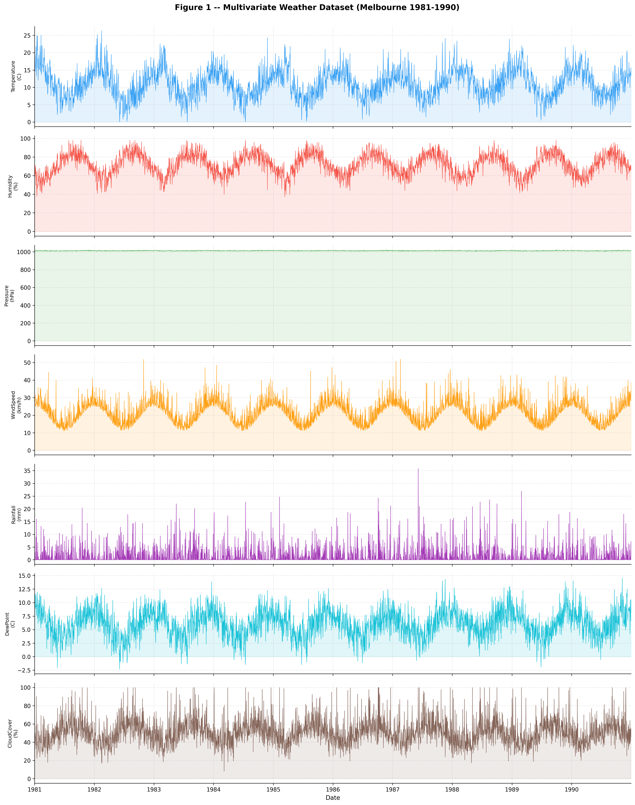
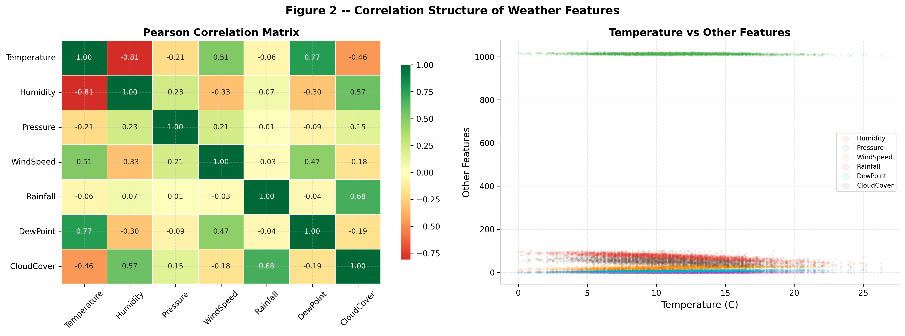
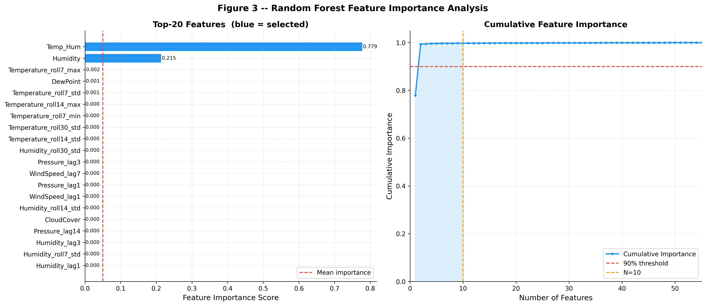
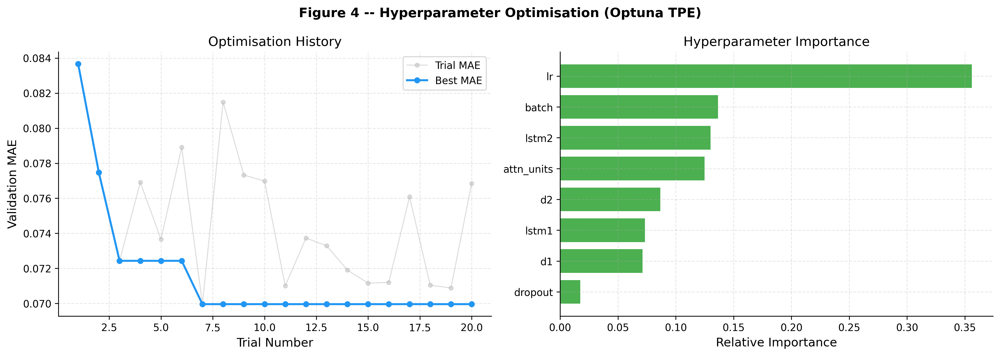
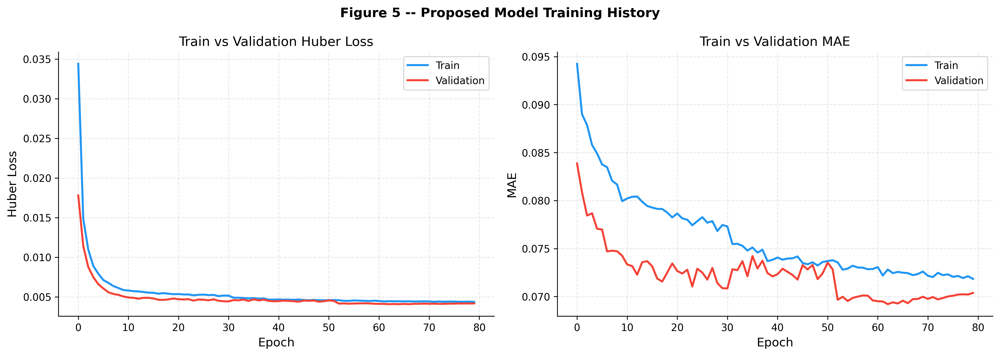
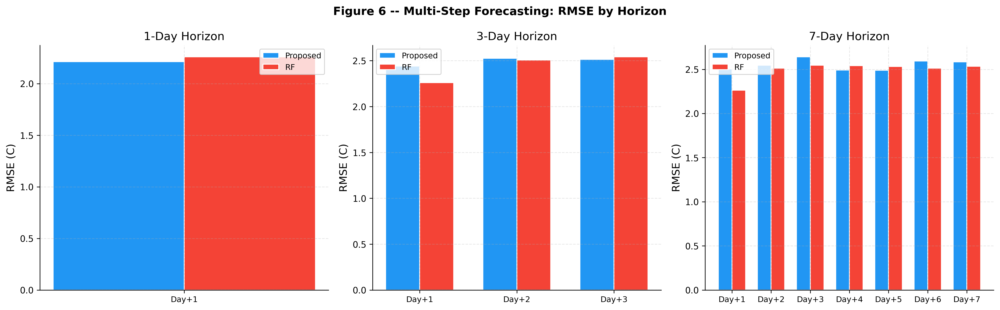
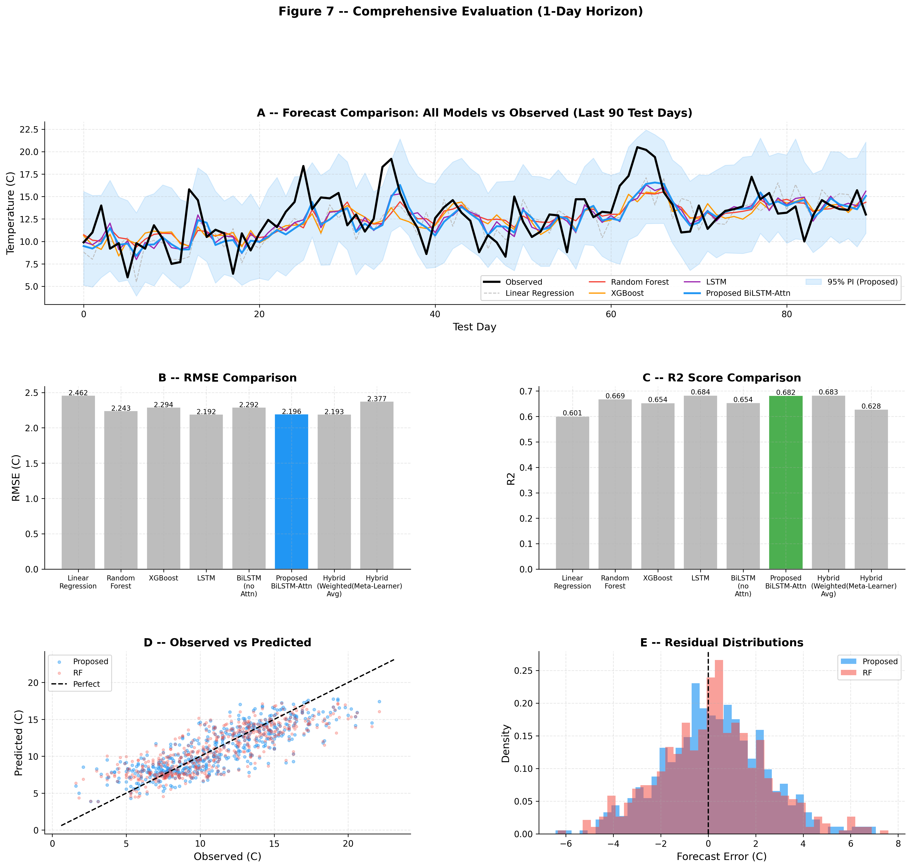
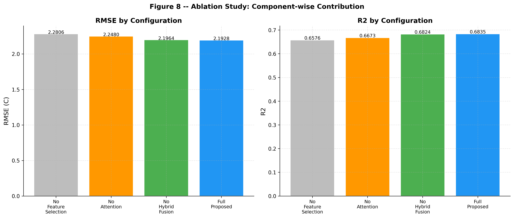
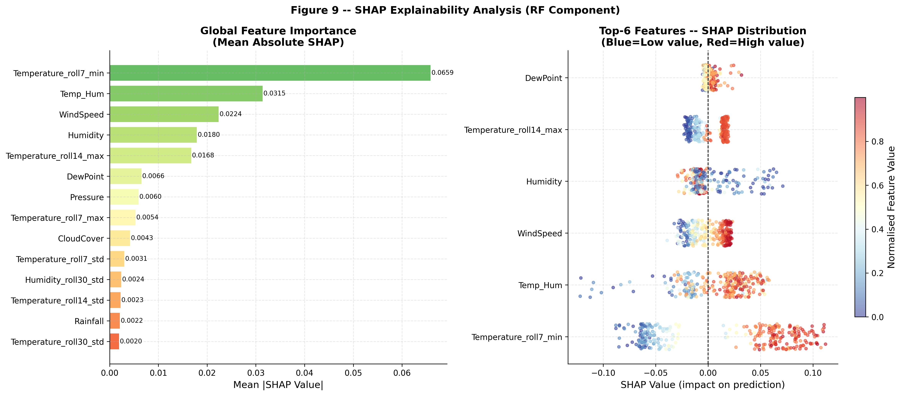
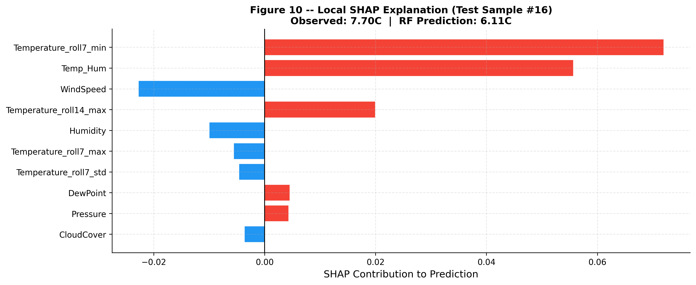

# 🌦️ Comparative Study of Weather Forecasting Models
### Time Series Weather Prediction using Linear Regression, Random Forest & LSTM

A machine learning and deep learning project that performs a **comparative analysis of three forecasting models**—**Linear Regression**, **Random Forest**, and **Long Short-Term Memory (LSTM)**—for weather prediction using historical temperature data.

The project evaluates the performance of each model using standard regression metrics and visualizes their predictions to determine the most suitable approach for time-series weather forecasting.

---

# 📌 Project Overview

Weather forecasting is one of the most important real-world applications of Machine Learning and Artificial Intelligence. Different algorithms perform differently depending on the nature of temporal data.

This project implements and compares three forecasting techniques:

- 📈 Linear Regression
- 🌳 Random Forest Regressor
- 🧠 Long Short-Term Memory (LSTM)

The objective is to compare their prediction accuracy, visualize the results, and generate future weather forecasts.

---

# 🎯 Objectives

- Predict future temperature values from historical weather data.
- Compare Machine Learning and Deep Learning approaches.
- Analyze prediction accuracy using multiple evaluation metrics.
- Generate a 7-day future weather forecast.
- Visualize model performance and forecasting results.

---

# 🏗️ Workflow

```text
                  Historical Weather Dataset
                            │
                            ▼
                    Data Preprocessing
                            │
                            ▼
                    Feature Scaling
                            │
                            ▼
               Create Time-Series Windows
                            │
        ┌────────────┬─────────────┬────────────┐
        │            │             │
        ▼            ▼             ▼
 Linear Regression  Random Forest   LSTM
        │            │             │
        └────────────┴─────────────┘
                     │
                     ▼
            Model Evaluation
                     │
                     ▼
          Comparative Performance
                     │
                     ▼
             7-Day Weather Forecast
```

---

# 🧠 Models Implemented

## 📈 Linear Regression

A baseline Machine Learning model that predicts future values using linear relationships in historical data.

### Advantages

- Fast training
- Simple implementation
- Easy interpretation
- Low computational cost

---

## 🌳 Random Forest Regressor

An ensemble learning algorithm that combines multiple decision trees to improve prediction accuracy and reduce overfitting.

### Advantages

- Handles non-linear relationships
- Robust to noise
- High prediction accuracy
- Less prone to overfitting

---

## 🧠 Long Short-Term Memory (LSTM)

A Recurrent Neural Network (RNN) architecture specifically designed for sequential and time-series data.

LSTM captures long-term temporal dependencies, making it highly suitable for weather forecasting.

### Advantages

- Learns temporal patterns
- Handles sequential data effectively
- Excellent for long-term forecasting
- Captures complex relationships

---

# 📊 Dataset

The project uses a historical weather dataset containing temperature observations over time.

The dataset is loaded directly using an external dataset URL (not included in this repository).

---

# ⚙️ Data Preprocessing

The notebook performs several preprocessing steps:

- Load dataset
- Handle missing values (if any)
- Select relevant weather features
- Normalize data using Min-Max Scaling
- Generate time-series sliding windows
- Split into training and testing datasets

---

# 🔄 Time-Series Windowing

Historical observations are converted into supervised learning samples using a sliding window approach.

Example

```text
Input

Day1 Day2 Day3 Day4 Day5

↓

Predict

Day6
```

This allows Machine Learning algorithms to learn temporal patterns.

---

# 📈 Model Evaluation

The models are evaluated using regression metrics including:

- RMSE (Root Mean Squared Error)
- MAE (Mean Absolute Error)
- MAPE (Mean Absolute Percentage Error)
- R² Score (Coefficient of Determination)

These metrics help compare forecasting accuracy across models.

---

# 📊 Visualizations & Results

The notebook provides a comprehensive visual analysis of the dataset, model development, training process, evaluation, and explainability.

---

## 📈 1. Multivariate Weather Dataset Overview

Visualizes the temporal trends of all major weather variables used for forecasting, including Temperature, Humidity, Pressure, Wind Speed, Rainfall, Dew Point, and Cloud Cover.

<p align="center">

</p>

---

## 🔗 2. Correlation Analysis

Explores relationships between weather variables using a Pearson correlation matrix and scatter plots to identify feature dependencies.

<p align="center">

</p>

---

## 🌲 3. Random Forest Feature Importance

Ranks engineered features according to their predictive importance and visualizes cumulative importance for feature selection.

<p align="center">

</p>

---

## ⚙️ 4. Hyperparameter Optimization (Optuna)

Illustrates the optimization history and the relative importance of tuned hyperparameters using Optuna's Tree-structured Parzen Estimator (TPE).

<p align="center">

</p>

---

## 🧠 5. Proposed Model Training History

Shows the convergence behaviour of the proposed BiLSTM-Attention model through training and validation Huber Loss and Mean Absolute Error (MAE).

<p align="center">

</p>

---

## 📅 6. Multi-Step Forecast Performance

Compares forecasting accuracy for 1-day, 3-day, and 7-day prediction horizons using RMSE.

<p align="center">

</p>

---

## 🏆 7. Comprehensive Model Evaluation

Provides an overall comparison of all forecasting models including:

- Forecast vs Observed Values
- RMSE Comparison
- R² Score Comparison
- Prediction Scatter Plot
- Residual Distribution

<p align="center">

</p>

---

## 🧪 8. Ablation Study

Evaluates the contribution of each major component of the proposed architecture, including Feature Selection, Attention Mechanism, and Hybrid Feature Fusion.

<p align="center">

</p>

---

## 🔍 9. SHAP Explainability Analysis

Global explainability using SHAP values to identify the most influential features affecting model predictions.

<p align="center">

</p>

---

## 🎯 10. Local SHAP Explanation

Explains the prediction for an individual test sample by showing the positive and negative contribution of each feature.

<p align="center">

</p>

---

---

# 🔮 7-Day Forecast

Each model recursively predicts the next seven days using its own previous predictions as input.

This allows comparison of future forecasting capability between:

- Linear Regression
- Random Forest
- LSTM

---

# 🛠️ Technologies Used

| Category | Technology |
|----------|------------|
| Language | Python |
| Machine Learning | Scikit-learn |
| Deep Learning | TensorFlow / Keras |
| Data Processing | NumPy, Pandas |
| Visualization | Matplotlib |
| Scaling | MinMaxScaler |
| Notebook | Jupyter / Google Colab |

---

# 📂 Project Structure

```text
.
├── Weather_Forecasting_Model.ipynb
├── README.md
├── requirements.txt
└── Dataset (External URL)
```

---

# 🚀 Installation

Clone the repository

```bash
git clone https://github.com/yourusername/Weather-Forecasting-Model.git
```

Move into the project directory

```bash
cd Weather-Forecasting-Model
```

Install dependencies

```bash
pip install -r requirements.txt
```

---

# ▶️ Running the Project

Launch Jupyter Notebook

```bash
jupyter notebook Weather_Forecasting_Model.ipynb
```

or upload the notebook to

- Google Colab

Run all cells sequentially.

---

# 📦 Required Libraries

```text
numpy
pandas
matplotlib
scikit-learn
tensorflow
keras
```

Install manually

```bash
pip install numpy pandas matplotlib scikit-learn tensorflow
```

or

```bash
pip install -r requirements.txt
```

---

# 📊 Results

The notebook compares the forecasting performance of:

- Linear Regression
- Random Forest
- LSTM

using identical datasets and preprocessing steps, allowing a fair evaluation of each model's strengths and weaknesses.

---

# 🔮 Future Improvements

- Multivariate weather forecasting
- Include humidity, pressure, rainfall, and wind speed
- Add XGBoost and LightGBM models
- Implement GRU and Bi-LSTM networks
- Hyperparameter optimization
- Attention-based forecasting models
- Deploy using Streamlit or Flask
- Real-time weather API integration

---

# 🤝 Contributing

Contributions are welcome!

You can contribute by:

- Improving forecasting models
- Optimizing preprocessing
- Adding new datasets
- Enhancing visualizations
- Reporting bugs or suggesting features

Feel free to open an Issue or submit a Pull Request.

---

If you found this project useful, consider giving it a ⭐ on GitHub!
